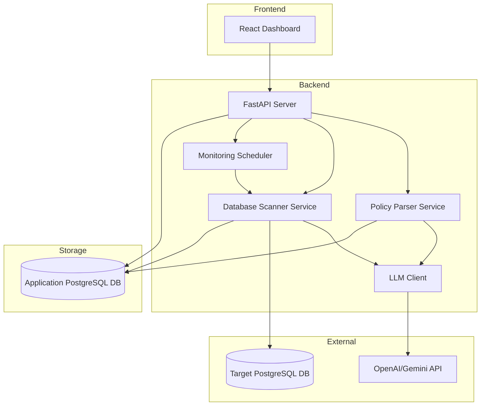
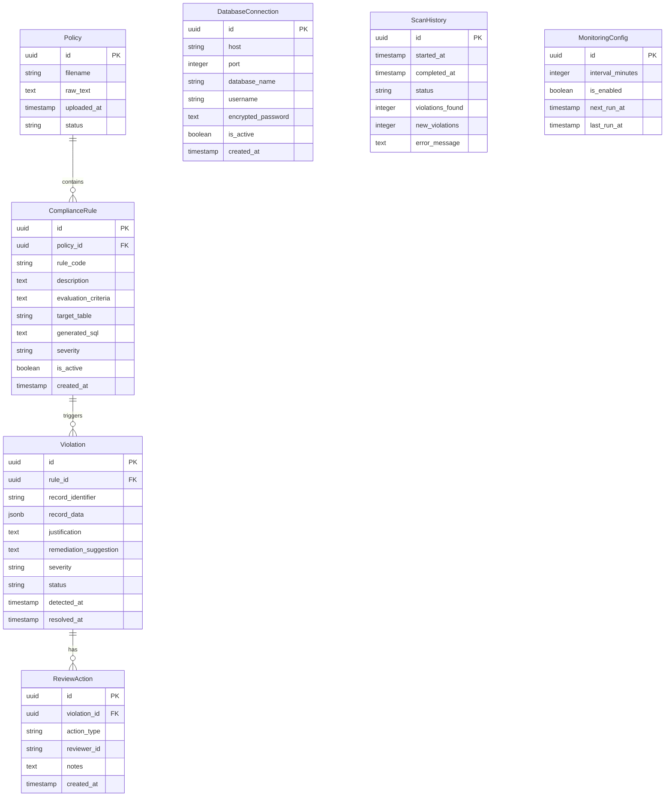

# Design Document: Data Policy Agent

## Overview

The Data Policy Agent is a full-stack compliance monitoring system built for a hackathon demo. It combines AI-powered PDF parsing with database scanning to automatically detect policy violations. The architecture follows a modular design with clear separation between the policy parsing layer, database scanning layer, and presentation layer.

The system uses:
- **Backend**: Python with FastAPI for REST APIs
- **Frontend**: React with TypeScript for the dashboard
- **Database**: PostgreSQL for storing compliance rules, violations, and audit logs
- **AI/LLM**: OpenAI or Google Gemini API for rule extraction and justification generation
- **PDF Processing**: pdfplumber for reliable text extraction

## Architecture



### Component Responsibilities

1. **FastAPI Server**: REST API endpoints for all operations
2. **Policy Parser Service**: PDF text extraction and LLM-based rule interpretation
3. **Database Scanner Service**: Schema discovery, query generation, and violation detection
4. **Monitoring Scheduler**: Background job scheduling using APScheduler
5. **LLM Client**: Abstraction layer for OpenAI/Gemini API calls
6. **React Dashboard**: User interface for viewing and managing compliance data

## Components and Interfaces

### Backend API Endpoints

```python
# Policy Management
POST   /api/policies/upload          # Upload PDF policy document
GET    /api/policies                  # List all policies
GET    /api/policies/{id}             # Get policy details with rules
DELETE /api/policies/{id}             # Remove a policy

# Compliance Rules
GET    /api/rules                     # List all extracted rules
GET    /api/rules/{id}                # Get rule details
PATCH  /api/rules/{id}                # Update rule (enable/disable)

# Database Connection
POST   /api/database/connect          # Test and save DB connection
GET    /api/database/schema           # Get target database schema
POST   /api/database/scan             # Trigger manual compliance scan

# Violations
GET    /api/violations                # List violations with filters
GET    /api/violations/{id}           # Get violation details
PATCH  /api/violations/{id}/review    # Submit review decision

# Monitoring
GET    /api/monitoring/status         # Get scheduler status
POST   /api/monitoring/schedule       # Configure scan schedule
DELETE /api/monitoring/schedule       # Disable scheduled scans

# Dashboard
GET    /api/dashboard/summary         # Get compliance summary stats
GET    /api/dashboard/trends          # Get violation trends over time
```

### Policy Parser Service

```python
class PolicyParserService:
    async def extract_text(self, pdf_file: UploadFile) -> str:
        """Extract text content from PDF using pdfplumber."""
        pass
    
    async def parse_rules(self, text: str, policy_id: str) -> list[ComplianceRule]:
        """Send text to LLM and parse response into structured rules."""
        pass
    
    async def process_policy(self, pdf_file: UploadFile) -> Policy:
        """Full pipeline: extract text, parse rules, store results."""
        pass
```

### Database Scanner Service

```python
class DatabaseScannerService:
    async def connect(self, connection_config: DBConnectionConfig) -> bool:
        """Establish connection to target PostgreSQL database."""
        pass
    
    async def get_schema(self) -> DatabaseSchema:
        """Retrieve table and column metadata from target database."""
        pass
    
    async def generate_query(self, rule: ComplianceRule, schema: DatabaseSchema) -> str:
        """Use LLM to generate SQL query for rule evaluation."""
        pass
    
    async def scan_for_violations(self, rules: list[ComplianceRule]) -> list[Violation]:
        """Execute queries and collect violations with justifications."""
        pass
    
    async def generate_justification(self, rule: ComplianceRule, record: dict) -> str:
        """Generate human-readable explanation for why record violates rule."""
        pass
    
    async def generate_remediation(self, violation: Violation) -> str:
        """Generate suggested remediation steps for a violation."""
        pass
```

### LLM Client Interface

```python
class LLMClient:
    async def extract_rules(self, policy_text: str) -> list[dict]:
        """Extract compliance rules from policy text."""
        pass
    
    async def generate_sql(self, rule: dict, schema: dict) -> str:
        """Generate SQL query to detect rule violations."""
        pass
    
    async def explain_violation(self, rule: dict, record: dict) -> str:
        """Generate explanation for why a record violates a rule."""
        pass
    
    async def suggest_remediation(self, violation: dict) -> str:
        """Generate remediation suggestion for a violation."""
        pass
```

### Monitoring Scheduler

```python
class MonitoringScheduler:
    def schedule_scan(self, interval_minutes: int) -> str:
        """Schedule periodic compliance scans."""
        pass
    
    def cancel_schedule(self) -> bool:
        """Cancel scheduled scans."""
        pass
    
    def get_status(self) -> SchedulerStatus:
        """Get current scheduler status and next run time."""
        pass
    
    async def run_scheduled_scan(self) -> ScanResult:
        """Execute a scheduled compliance scan."""
        pass
```

### Frontend Components

```typescript
// Main Dashboard Components
DashboardPage          // Main compliance overview
PolicyUploadForm       // PDF upload with drag-and-drop
ViolationList          // Filterable violation table
ViolationDetail        // Full violation report view
ReviewPanel            // Human review decision interface
TrendChart             // Compliance trends visualization
ScheduleConfig         // Monitoring schedule configuration
DatabaseConfig         // Database connection setup
```

## Data Models

### Application Database Schema



### Pydantic Models

```python
from pydantic import BaseModel
from datetime import datetime
from uuid import UUID
from enum import Enum

class ViolationStatus(str, Enum):
    PENDING = "pending"
    CONFIRMED = "confirmed"
    FALSE_POSITIVE = "false_positive"
    RESOLVED = "resolved"

class Severity(str, Enum):
    LOW = "low"
    MEDIUM = "medium"
    HIGH = "high"
    CRITICAL = "critical"

class PolicyCreate(BaseModel):
    filename: str

class PolicyResponse(BaseModel):
    id: UUID
    filename: str
    status: str
    uploaded_at: datetime
    rule_count: int

class ComplianceRuleResponse(BaseModel):
    id: UUID
    policy_id: UUID
    rule_code: str
    description: str
    evaluation_criteria: str
    target_table: str | None
    severity: Severity
    is_active: bool

class ViolationResponse(BaseModel):
    id: UUID
    rule_id: UUID
    rule_code: str
    rule_description: str
    record_identifier: str
    record_data: dict
    justification: str
    remediation_suggestion: str | None
    severity: Severity
    status: ViolationStatus
    detected_at: datetime

class ReviewDecision(BaseModel):
    action: str  # "confirm", "false_positive", "resolve"
    notes: str | None = None

class DBConnectionConfig(BaseModel):
    host: str
    port: int = 5432
    database: str
    username: str
    password: str

class ScanResult(BaseModel):
    scan_id: UUID
    started_at: datetime
    completed_at: datetime
    total_violations: int
    new_violations: int
    status: str

class DashboardSummary(BaseModel):
    total_violations: int
    pending_count: int
    confirmed_count: int
    resolved_count: int
    by_severity: dict[str, int]
    last_scan_at: datetime | None
    next_scan_at: datetime | None

class TrendDataPoint(BaseModel):
    date: str
    violations: int
    resolved: int
```

### LLM Prompt Templates

```python
RULE_EXTRACTION_PROMPT = """
Analyze the following policy document and extract all compliance rules.
For each rule, provide:
1. rule_code: A short identifier (e.g., "DATA-001")
2. description: Human-readable description of the rule
3. evaluation_criteria: Specific conditions that constitute a violation
4. severity: low, medium, high, or critical
5. target_entities: What type of data this rule applies to

Policy Document:
{policy_text}

Return as JSON array of rules.
"""

SQL_GENERATION_PROMPT = """
Given the following compliance rule and database schema, generate a SQL query
that identifies records violating this rule.

Rule: {rule_description}
Evaluation Criteria: {evaluation_criteria}

Database Schema:
{schema_json}

Return only the SQL query that selects violating records.
Include the primary key and relevant columns in the SELECT.
"""

JUSTIFICATION_PROMPT = """
Explain why the following database record violates the compliance rule.
Be specific and reference the actual field values.

Rule: {rule_description}
Evaluation Criteria: {evaluation_criteria}

Record Data:
{record_json}

Provide a clear, concise explanation suitable for a compliance review.
"""

REMEDIATION_PROMPT = """
Suggest remediation steps for the following compliance violation.

Rule: {rule_description}
Violation: {justification}
Record Data: {record_json}

Provide specific, actionable steps to resolve this violation.
"""
```


## Correctness Properties

*A property is a characteristic or behavior that should hold true across all valid executions of a system—essentially, a formal statement about what the system should do. Properties serve as the bridge between human-readable specifications and machine-verifiable correctness guarantees.*

### Property 1: Compliance Rule Structure Validity

*For any* policy text processed by the Policy_Parser, all returned Compliance_Rules SHALL contain a non-empty rule_code, description, and evaluation_criteria field.

**Validates: Requirements 1.3**

### Property 2: Policy-to-Rules Round Trip

*For any* successfully parsed Policy_Document, storing and then retrieving the associated Compliance_Rules SHALL return rules that reference the original policy ID and contain the same content.

**Validates: Requirements 1.6**

### Property 3: Schema Retrieval Accuracy

*For any* connected PostgreSQL database, the retrieved schema SHALL accurately reflect all table names, column names, and data types present in the actual database.

**Validates: Requirements 2.2**

### Property 4: Scan Completeness

*For any* compliance scan with N active Compliance_Rules, the scan SHALL evaluate all N rules and return results for each.

**Validates: Requirements 2.3**

### Property 5: Generated SQL Validity

*For any* Compliance_Rule with evaluation criteria, the generated SQL query SHALL be syntactically valid PostgreSQL that can be executed without syntax errors.

**Validates: Requirements 2.4**

### Property 6: Violation Report Completeness

*For any* detected violation, the Violation_Report SHALL contain a non-null rule_id, record_identifier, record_data with at least one field, and a non-empty justification string.

**Validates: Requirements 3.1, 3.2**

### Property 7: Severity Inheritance

*For any* Violation created from a Compliance_Rule, the Violation's severity SHALL equal the source rule's severity.

**Validates: Requirements 3.3**

### Property 8: Multi-Violation Grouping

*For any* database record that violates multiple Compliance_Rules, all violations for that record SHALL share the same record_identifier.

**Validates: Requirements 3.4**

### Property 9: Violation Persistence Round Trip

*For any* Violation_Report created by the system, storing and then retrieving it SHALL return the same violation data with a valid detected_at timestamp.

**Validates: Requirements 3.5**

### Property 10: New Violation Initial Status

*For any* newly detected violation, the initial status SHALL be "pending".

**Validates: Requirements 4.1**

### Property 11: Review Status Transitions

*For any* review action (confirm, false_positive, resolve) on a violation, the violation status SHALL update to the corresponding state and a ReviewAction audit entry SHALL be created with the reviewer identity and timestamp.

**Validates: Requirements 4.3, 4.4, 4.6**

### Property 12: New Violation Detection

*For any* scheduled scan, violations that did not exist in the previous scan results SHALL be marked as new violations.

**Validates: Requirements 5.2**

### Property 13: Scan Interval Configuration

*For any* interval value between 60 (hourly) and 1440 (daily) minutes, the Monitoring_Scheduler SHALL accept and store the configuration.

**Validates: Requirements 5.6**

### Property 14: Dashboard Summary Accuracy

*For any* set of violations in the database, the dashboard summary counts (total, pending, confirmed, resolved, by_severity) SHALL equal the actual counts when filtered by those criteria.

**Validates: Requirements 6.1**

### Property 15: Violation Filtering Correctness

*For any* filter combination (status, severity, rule_id, date_range), the returned violations SHALL only include records matching ALL specified filter criteria.

**Validates: Requirements 6.5**

### Property 16: Remediation Generation

*For any* Violation_Report, the system SHALL generate a non-empty remediation_suggestion string or explicitly mark it as requiring manual review.

**Validates: Requirements 7.1**

### Property 17: Summary Report Accuracy

*For any* specified time period, the compliance summary report SHALL contain accurate counts of violations found, resolved, and pending that match the actual database records within that period.

**Validates: Requirements 8.1, 8.2**

### Property 18: Trend Percentage Calculation

*For any* two consecutive time periods with violation counts V1 and V2, the calculated improvement/degradation percentage SHALL equal ((V1 - V2) / V1) * 100 when V1 > 0.

**Validates: Requirements 8.3**

## Error Handling

### PDF Processing Errors

| Error Condition | Response | User Feedback |
|----------------|----------|---------------|
| Corrupted PDF | Return error, do not store | "Unable to read PDF file. Please ensure the file is not corrupted." |
| Empty PDF | Return error | "The uploaded PDF contains no extractable text." |
| Unsupported format | Return error | "Please upload a valid PDF file." |
| File too large | Return error | "File exceeds maximum size limit of 10MB." |

### LLM API Errors

| Error Condition | Response | Recovery |
|----------------|----------|----------|
| API timeout | Queue for retry | Retry with exponential backoff (1s, 2s, 4s, max 3 retries) |
| Rate limit exceeded | Queue for retry | Wait for rate limit reset, then retry |
| Invalid response format | Log error, flag for review | Notify user that manual rule entry may be needed |
| API unavailable | Queue document | Notify user of delay, process when available |

### Database Connection Errors

| Error Condition | Response | User Feedback |
|----------------|----------|---------------|
| Invalid credentials | Return error | "Authentication failed. Please check username and password." |
| Host unreachable | Return error | "Unable to connect to database host. Please verify the hostname and port." |
| Database not found | Return error | "Database '{name}' not found on the server." |
| Connection timeout | Return error with retry option | "Connection timed out. Please try again." |
| SSL/TLS error | Return error | "Secure connection failed. Please check SSL configuration." |

### Scan Execution Errors

| Error Condition | Response | Recovery |
|----------------|----------|----------|
| SQL syntax error | Skip rule, flag for review | Log error, continue with other rules |
| Query timeout | Skip rule, log warning | Mark rule as needing optimization |
| Permission denied | Skip table, log error | Notify user of insufficient permissions |
| Connection lost mid-scan | Abort scan, save partial results | Allow user to resume or restart |

### Validation Errors

| Input | Validation | Error Message |
|-------|------------|---------------|
| Scan interval | 60 ≤ interval ≤ 1440 | "Scan interval must be between 1 hour and 24 hours." |
| Database port | 1 ≤ port ≤ 65535 | "Invalid port number." |
| Review action | Must be valid enum value | "Invalid review action." |

## Testing Strategy

### Testing Approach

The Data Policy Agent uses a dual testing approach combining unit tests for specific examples and edge cases with property-based tests for universal correctness guarantees.

**Unit Tests**: Focus on specific examples, integration points, and error conditions
**Property Tests**: Verify universal properties across randomly generated inputs

### Property-Based Testing Configuration

- **Library**: Hypothesis (Python) for backend, fast-check (TypeScript) for frontend
- **Iterations**: Minimum 100 iterations per property test
- **Tag Format**: `Feature: data-policy-agent, Property {N}: {property_text}`

### Backend Test Structure

```
tests/
├── unit/
│   ├── test_policy_parser.py      # PDF extraction, error handling
│   ├── test_db_scanner.py         # Connection, schema retrieval
│   ├── test_llm_client.py         # API mocking, response parsing
│   ├── test_scheduler.py          # Schedule configuration
│   └── test_api_endpoints.py      # Request/response validation
├── property/
│   ├── test_rule_properties.py    # Properties 1, 2
│   ├── test_scan_properties.py    # Properties 3, 4, 5
│   ├── test_violation_properties.py # Properties 6, 7, 8, 9, 10
│   ├── test_review_properties.py  # Property 11
│   ├── test_monitoring_properties.py # Properties 12, 13
│   ├── test_dashboard_properties.py # Properties 14, 15, 18
│   └── test_summary_properties.py # Properties 16, 17
└── integration/
    ├── test_policy_pipeline.py    # End-to-end policy processing
    ├── test_scan_pipeline.py      # End-to-end scanning
    └── test_review_workflow.py    # Human review flow
```

### Frontend Test Structure

```
src/
├── __tests__/
│   ├── components/
│   │   ├── ViolationList.test.tsx
│   │   ├── ReviewPanel.test.tsx
│   │   └── TrendChart.test.tsx
│   └── property/
│       └── filtering.property.test.ts  # Property 15
```

### Test Data Generation

For property-based tests, use Hypothesis strategies to generate:

```python
from hypothesis import strategies as st

# Generate random compliance rules
rule_strategy = st.fixed_dictionaries({
    "rule_code": st.text(min_size=1, max_size=20),
    "description": st.text(min_size=10, max_size=500),
    "evaluation_criteria": st.text(min_size=5, max_size=200),
    "severity": st.sampled_from(["low", "medium", "high", "critical"]),
    "is_active": st.booleans()
})

# Generate random violations
violation_strategy = st.fixed_dictionaries({
    "record_identifier": st.text(min_size=1, max_size=50),
    "record_data": st.dictionaries(st.text(min_size=1), st.text()),
    "severity": st.sampled_from(["low", "medium", "high", "critical"]),
    "status": st.sampled_from(["pending", "confirmed", "false_positive", "resolved"])
})

# Generate scan intervals
interval_strategy = st.integers(min_value=60, max_value=1440)
```

### Key Test Scenarios

**Policy Parsing**:
- Valid PDF with clear policy text
- PDF with tables and complex formatting
- Corrupted/invalid PDF files
- Empty PDF files

**Database Scanning**:
- Database with violations present
- Database with no violations
- Rules that cannot be translated to SQL
- Connection failures during scan

**Human Review**:
- Confirm violation flow
- Mark as false positive flow
- Concurrent review actions

**Monitoring**:
- Schedule creation and modification
- Scan execution and new violation detection
- Failure recovery with retry
